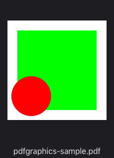

# PDFGraphics

Provide convenient way to extract PDF format data from CGContext.

[](https://github.com/Carthage/Carthage)

```swift
let data = PDFGraphics(with: CGSize(width: 100, height: 100)) { (ctx) in
    ctx.addRect(CGRect(x: 10, y: 10, width: 80, height: 80))
    ctx.setFillColor(NSColor.green.cgColor)
    ctx.fillPath()
    
    ctx.addEllipse(in: CGRect(x: 4, y: 4, width: 40, height: 40))
    ctx.setFillColor(NSColor.red.cgColor)
    ctx.fillPath()
}
try? data.write(to: url)
```



## As image

- macOS: PDF data is **supported** by NSImage
- iOS: PDF data is **NOT supported** by UIImage


## As data

PDFKit is also available in macOS and iOS. You can present PDF data using PDFView with PDFDocument.

- macOS: PDFKit is available but NOT as separated single module. Quartz module contains PDFKit.
- iOS: PDFKit module is available.
